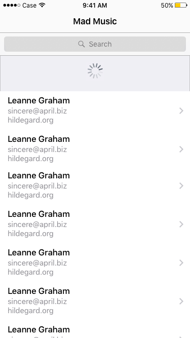
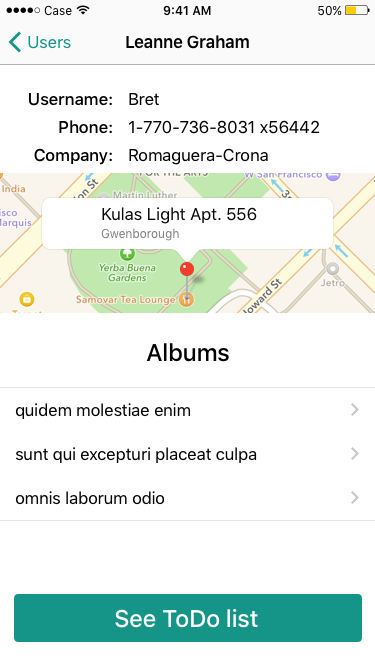
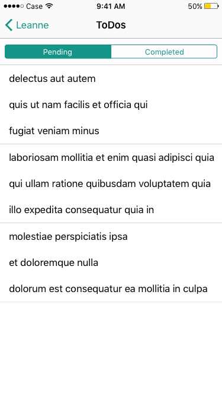

# Mckinley & Rice NodeJs Coding Challenge

> Welcome to the Mckinley & Rice Coding Challenge!

## Overview

To complete this challenge, you will need to write a  web app, and provide us the source files to be built.

This challenge is expected to take about 3-4 hours.

# iOS Developer Coding Challenge

This test app consists of a list of users, and their music albums and To-Do lists.

## Considerations

1. This test should be design with latest version of Xcode and for latest version of iOS.
1. The app should have these basic screens:
    - [Main screen](#main-screen) (list of users)
    - [User screen](#user-screen)
    - [Album photos screen](#album-pics-screen)
    - [To-Do list](#to-do-screen)
1. The code should follow Apple's Model-View-Controller and Delegates rules if possible.
1. A good use of REST services (for fetching data) is encouraged.
1. The app should be responsive in any of Apple's devices (iPhones and iPads)
1. The fetched data should be saved in Core Data to avoid making too many HTTP calls.
1. The user should be capable of searching users by their address.
1. Pulling the main users list table should refresh the table data.
1. The code has to be Unit Tested.
1. The UI can be freely designed. A good app is always beautiful!
1. Including UI Tests is optional but investigation is always welcome!

## Main screen

The first screen to show is a table of users, fetched from the `/users` resource of [JSONPlaceholder](https://jsonplaceholder.typicode.com).

## User screen

This screen shows the details of an user, a map pin of its address, a table of [his albums](#albums-pics-screen) (fetched from the `/albums` resource of [JSONPlaceholder](https://jsonplaceholder.typicode.com)), and a button to see his [To-Do list](#to-do-list).

## Album pics screen

This screen shows a collection of an album's photos, fetched from the `/photos` resource of [JSONPlaceholder](https://jsonplaceholder.typicode.com).

## To-Do screen

This screen shows a table of an user's To-Do list, fetched from the `/todos` resource of [JSONPlaceholder](https://jsonplaceholder.typicode.com). Additionally, there is a selector to filter completed/not-completed To-Dos.

